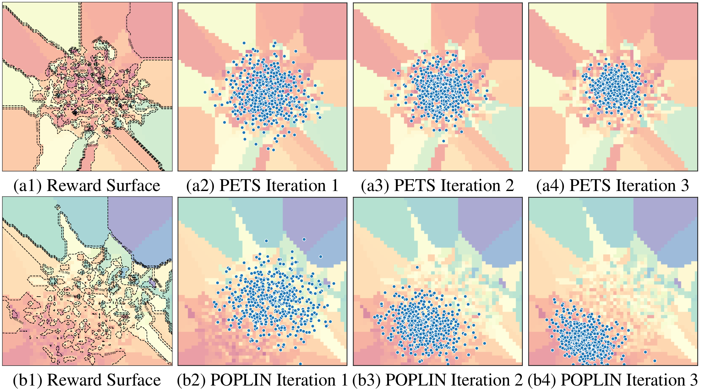
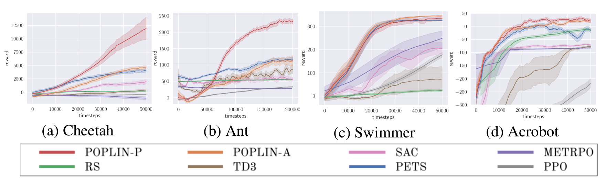
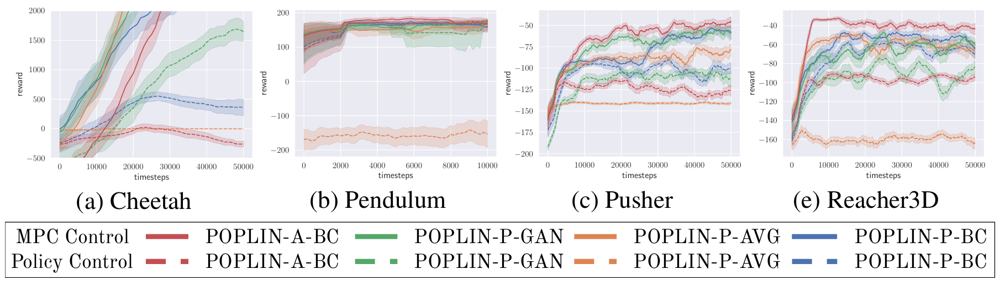

# POPLIN
<p align=center>

</p>

[Arxiv Link](https://arxiv.org/abs/1906.08649)
**Abstract** Model-based reinforcement learning (MBRL) with model-predictive control or online planning has shown great potential for locomotion control tasks in terms of both sample efficiency and asymptotic performance. However, the existing planning methods search from candidate sequences that are randomly generated in the action space. We argue that random action search is inefficient in complex high-dimensional environments. In this paper, we propose a novel MBRL algorithm, model-based policy planning (POPLIN), that combines policy networks with online planning. More specifically, we formulate action planning at each time-step as an optimization problem using neural networks. We experiment with both optimization w.r.t. the action sequences initialized from the policy network, and also online optimization directly w.r.t. the parameters of the policy network. We show that POPLIN obtains state-of-the-art performance in the MuJoCo benchmarking environments, being about 3x more sample efficient than the state-of-the-art algorithms, such as PETS, TD3 and SAC. To explain the effectiveness of our algorithm, we show that the optimization surface in parameter space is smoother than in action space. Further more, we found the distilled policy network can be effectively applied without the expansive model predictive control during test time for some environments such as Cheetah.

### Performance
Below are some of the benchmarking results of POPLIN compared with other state-of-the-art algorithms

Result Curves
<p align=center>

</p>
Result Table
<p align=center>

</p>

### Policy Control
The performance of only policy control without model-predictive control (MPC) or online planning.
<p align=center>

</p>

## Installation
This code-base is based on [PETS](https://github.com/kchua/handful-of-trials).
run ```pip install -r requirements.txt.``` to install the python dependency.
The current environments are simulated with MuJoCo 1.31. Please follow the installation procedures of MuJoCo + OpenAI gym, if the default pip installation fails.

# Run the code!
Below are some examples to reproduce the results.
The full example scripts are stored under ```./demo_scripts/```.

## POPLIN-A
In model-based policy planning in action space (POPLIN-A), we use a policy network to generate good initial solution distribution.
```
python mbexp.py -logdir ./log/POPLIN_A \
    -env halfcheetah \
    -o exp_cfg.exp_cfg.ntrain_iters 50 \
    -o ctrl_cfg.cem_cfg.cem_type POPLINA-INIT \
    -o ctrl_cfg.cem_cfg.training_scheme BC-AI \
    -o ctrl_cfg.cem_cfg.test_policy 1 \
    -ca model-type PE -ca prop-type E \
    -ca opt-type POPLIN-A
```

## POPLIN-P
We also propose model-based policy planning in parameter space (POPLIN-P).
Instead of adding noise in the action space, POPLIN-P adds noise in the parameter space of the policy network.
```
python mbexp.py -logdir ./log/POPLINP_AVG -env halfcheetah \
    -o exp_cfg.exp_cfg.ntrain_iters 50 \
    -o ctrl_cfg.cem_cfg.cem_type POPLINP-SEP \
    -o ctrl_cfg.cem_cfg.training_scheme AVG-R \
    -o ctrl_cfg.cem_cfg.policy_network_shape [32] \
    -o ctrl_cfg.opt_cfg.init_var 0.1 \
    -o ctrl_cfg.cem_cfg.test_policy 1 \
    -ca model-type PE -ca prop-type E \
    -ca opt-type POPLIN-P
```

## PETS
```
python mbexp.py -logdir ./log/PETS \
    -env halfcheetah \
    -o exp_cfg.exp_cfg.ntrain_iters 50 \
    -ca opt-type CEM \
    -ca model-type PE \
    -ca prop-type E
```

## Changing Hyper-parameters

This repo is based on the PETS repo. And therefore we use the same hyper-parameters / arguments system.
We recommend looking at their repo or our sample scripts under ```./demo_scripts``` to better use our repo.

### Environment Arguments

The ```mbbl``` package required in some of the environments (the environments which start with ''gym'') will be soon released in a different project.
```
python scripts/mbexp.py
    -env    (required) The name of the environment. Select from
            [reacher, pusher, halfcheetah, gym_ant, gym_cartpole, gym_fswimmer, ...].
```
Please look at ```./dmbrl/config``` for more environments.

### Control Arguments

```
python scripts/mbexp.py
-ca model-type   : Same as the one defined in PETS repo.
-ca prop-type    : Same as the one defined in PETS repo.
-ca opt-type     : The optimizer that will be used to select action sequences.
                   Select from [Random, CEM, POPLIN-A, POPLIN-P].
                   Make sure to select the correct opt-type before setting the other configs
```

### Other Arguments

All the old arguments are kept the same as they were in [PETS](https://github.com/kchua/handful-of-trials).
We refer the original code repo for the old arguments.
The new arguements are summarized as follows:

```
 ├──exp_cfg                                 - Experiment script configuration.
 │    ├── sim_cfg                           - Simulation configuration.
 │    ├── exp_cfg                           - Experiment configuration.
 │    │    └── ntrain_iters                 - Number of training iterations.
 │    │         
 │    └── log_cfg                           - Logger configuration.
 └── ctrl_cfg (MPC)                         - Controller configuration.
      │         
      ├── opt_cfg                           - Optimization configuration.
      │    ├── plan_hor                     - Planning horizon.
      │    ├── init_var                     - Initial variance of the CEM search.
      │    └── cfg                          - Optimizer configuration.
      │         ├── popsize    (ALL)        - Number of candidate solutions sampled (per iteration
      │         │                             for CEM).
      │         ├── max_iters  (ALL)        - Maximum number of optimization iterations.
      │         ├── num_elites (ALL)        - Number of elites used to refit Gaussian.
      │         └── epsilon    (ALL)        - Minimum variance for termination condition.
      │         
      └── cem_cfg                           - Other CEM config, especiailly the ones for POPLIN.
           ├── cem_type                     - Choose the variant of POPLIN to use
           │                                  ['POPLINA-INIT', 'POPLINA-REPLAN', (for POPLIN-A)
           │                                   'POPLINP-SEP', 'POPLINP-UNI'      (for POPLIN-P)]
           ├── training_scheme              - Choose the training schemse for the POPLIN
           │                                  ['BC-AR', 'BC-AI'                  (for POPLIN-A)
           │                                   'BC-PR', 'BC-PI'                  (for POPLIN-P)
           │                                   'AVG-R', 'AVG-I'                  (for POPLIN-P)
           │                                   'GAN-R', 'GAN-I'                  (for POPLIN-P)]
           ├── pct_testset                  - The percentage of data put into validation set.
           ├── policy_network_shape         - The shape of the policy network.
           │                                  Default is [64, 64]
           │                                  Recommended: [], [32], [64] (one hidden layer)
           ├── policy_epochs                - Epochs of training the policy network.
           ├── policy_lr                    - The learning rate to train the policy network.
           ├── policy_weight_decay          - Weight decay applied to the policy network.
           ├── minibatch_size               - The batchsize of training policy network.
           ├── test_policy                  - If set to 1, the agent will generate policy control
           │                                  results. Not appliable for POPLIN-A or PETS.
           └── discriminator*               - The configs for training the discrimnator for
                                              POPLIN-P-GAN. Similar to the ones of policy network.
```

To set these parameters, follow the below example scripts for POPLINA-P:
```
python mbexp.py -logdir ./log/POPLINP_AVG -env halfcheetah \
    -o exp_cfg.exp_cfg.ntrain_iters 50 \
    -o ctrl_cfg.cem_cfg.cem_type POPLINP-SEP \
    -o ctrl_cfg.cem_cfg.training_scheme AVG-R \
    -o ctrl_cfg.cem_cfg.policy_network_shape [32] \
    -o ctrl_cfg.opt_cfg.init_var 0.1 \
    -o ctrl_cfg.cem_cfg.test_policy 1 \
    -ca model-type PE -ca prop-type E \
    -ca opt-type POPLIN-P
```

# Results Logger

Results will be saved in `<logdir>/<date+time of experiment start>/logs.mat`.
Besides the original contents, we also have the ```test_return``` data in the result mat.
```
{"observations":            the observation generated in the training
 "actions":                 the actions generated in the training
 "rewards":                 the rewards generated in the training
 "returns":                 the return of MPC-control
 "test_returns":            the return of policy-control}
```

The logging file generated during the training can be observed in ```<logdir>/*/*.log/logger.log```.
